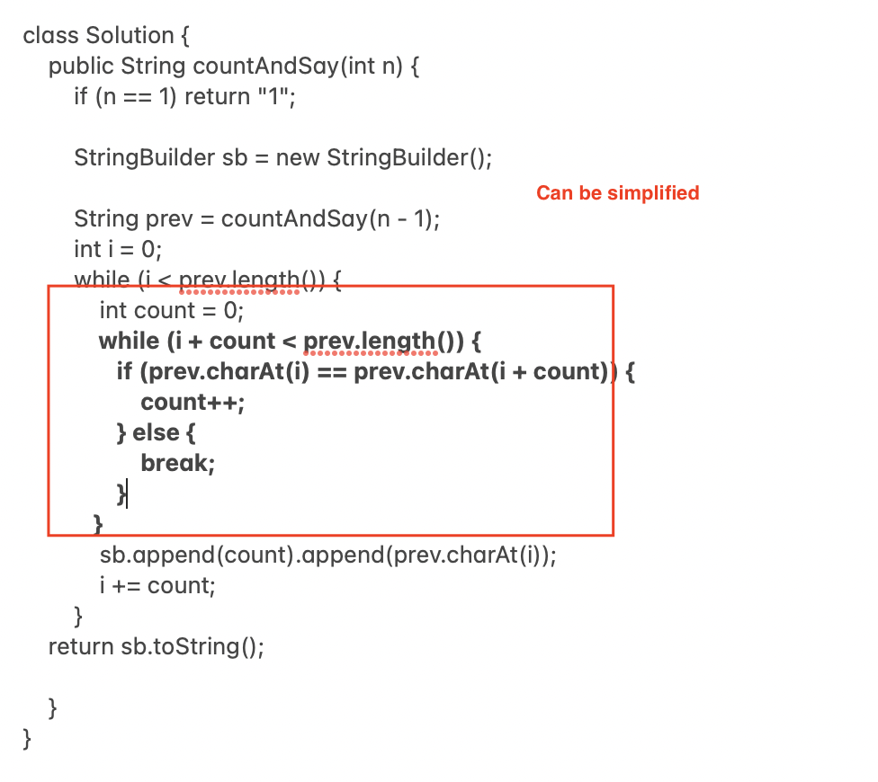

# \

# 

\

class Solution {
    public String countAndSay(int n) {
        if (n == 1) return "1";
        
        StringBuilder sb = new StringBuilder();
        
        String prev = countAndSay(n - 1);
        int i = 0;
        while (i < prev.length()) {
**            int count = 1; ———> **if we initialize  count to be 1 it will improve the performance because the default  count for any character is 1. If we start from 0, even if there is only one occurrence of this character, below code would still be executed.**
**
           **_ while (i + count < prev.length() && prev.charAt(i) == prev.charAt(i + count)) {_**
**_                count++;             _**
**_            }_**

            sb.append(count).append(prev.charAt(i));
            i += count;
        }
    return sb.toString();
    }
}
